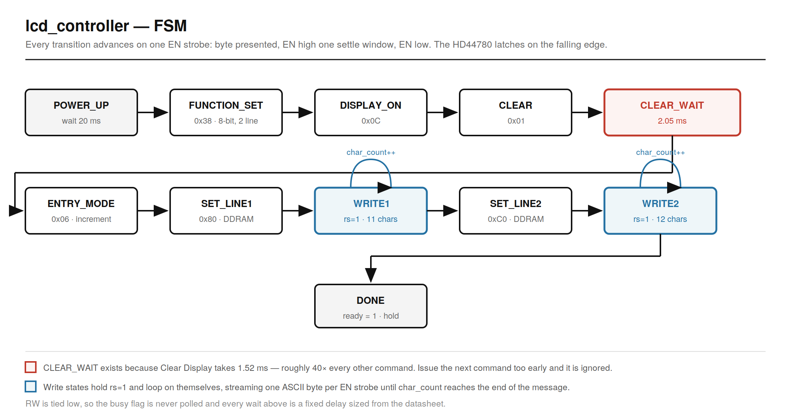
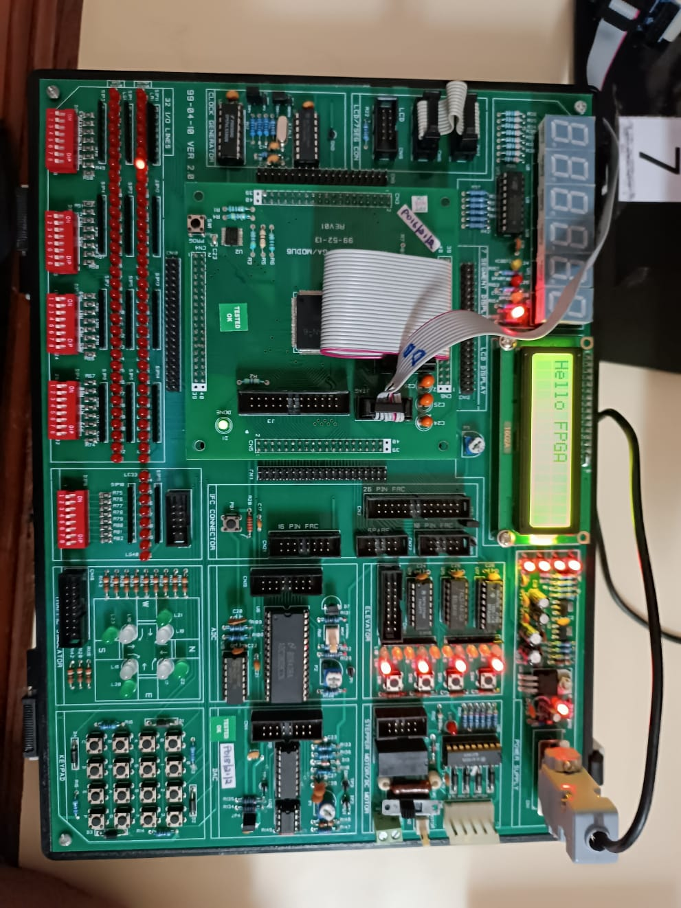
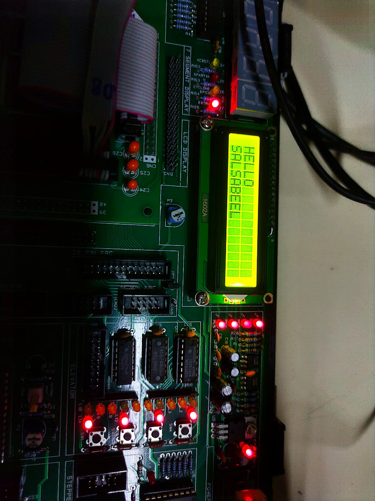
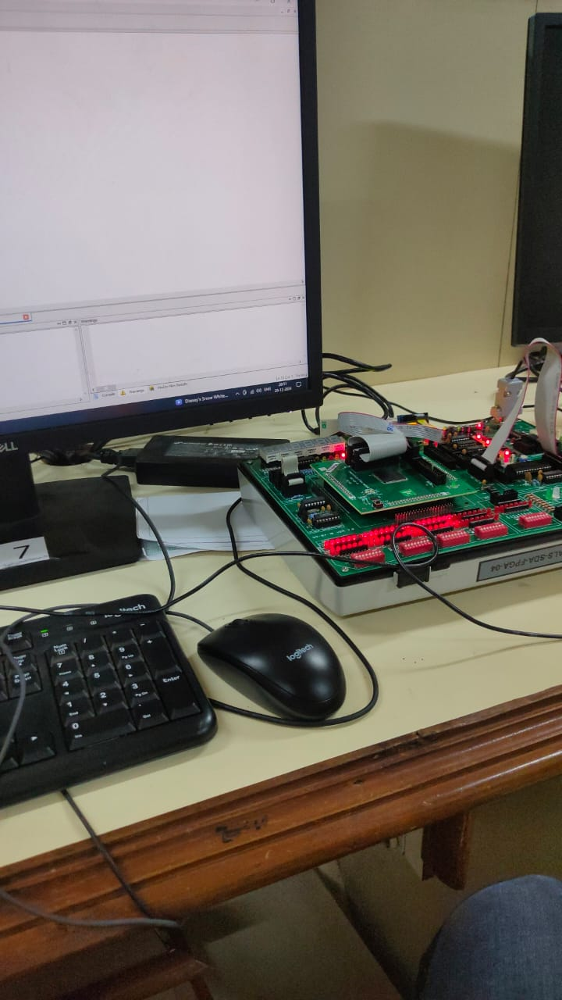
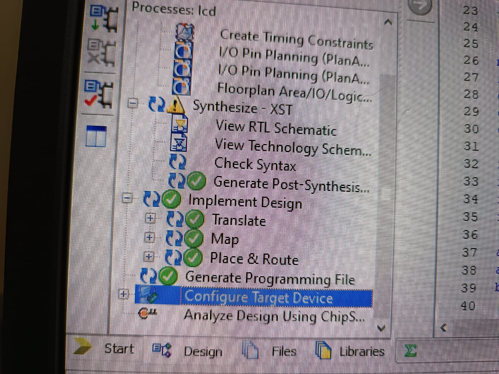

# Verilog LCD Character-Display Driver — Spartan-6

An RTL driver for a **16×2 HD44780 character LCD**, written in Verilog and taken through the full
FPGA flow: RTL → simulation → synthesis in **Xilinx ISE** → bring-up on a **Spartan-6** board.

Solo project, 5th semester.


---

## FSM



Each transition takes one EN strobe: the byte is presented, EN goes high for a settle window, then
low. The HD44780 latches the bus on the **falling** edge of EN.

`RW` is tied low, so the busy flag is never polled. Every wait is a fixed delay sized from the
datasheet — the simpler approach, at the cost of having to get those delays right.

---

## The timing that matters

Most HD44780 commands execute in about **37 µs**, so a single 50 µs settle window covers them
comfortably. **Clear Display (0x01) is the exception at 1.52 ms** — roughly forty times longer than
everything else.

Issue the next command before the clear finishes and the controller is still busy, so the command
is simply dropped. The symptom on hardware is characters missing from the start of line 1, or a
display that works intermittently depending on how fast the board comes up.

`CLEAR_WAIT` exists for exactly this. At the default 50 MHz / 50 µs parameters:

| Delay | Ticks | Time | Datasheet minimum |
|---|---|---|---|
| Power-on | 401 | 20.05 ms | > 15 ms |
| Clear Display | 41 | 2.05 ms | > 1.52 ms |

---

## Interface

| Signal | Dir | Meaning |
|---|---|---|
| `clk` | in | board oscillator (`CLK_HZ` parameter, default 50 MHz) |
| `rst` | in | active-high reset |
| `rs` | out | 0 = command, 1 = data |
| `rw` | out | tied low (write-only) |
| `en` | out | enable strobe |
| `data[7:0]` | out | 8-bit command/data bus |
| `ready` | out | high once both lines have been written |

Parameters: `CLK_HZ` (board clock) and `EN_US` (settle window). The datasheet delays are derived
from `EN_US`, so changing the clock doesn't silently break the timing.

Edit the `line1` / `line2` arrays in [`rtl/lcd_controller.v`](rtl/lcd_controller.v) to display
different text.

---

## Simulate

```bash
make sim        # compile and run
make wave       # open the VCD in GTKWave
```

Or directly with [Icarus Verilog](http://iverilog.icarus.com/):

```bash
iverilog -g2012 -o lcd.out rtl/lcd_controller.v tb/lcd_controller_tb.v && vvp lcd.out
```

The testbench is **self-checking**. It captures every byte on the falling edge of EN and compares
the stream against the expected HD44780 sequence, then verifies the Clear Display delay against the
datasheet minimum:

```
  [ 0] CMD  0x38 (8)  ok
  [ 1] CMD  0x0c (.)  ok
  [ 2] CMD  0x01 (.)  ok
  ...
  [15] DATA 0x4b (K)  ok
  [16] CMD  0xc0 (.)  ok
  ...
Clear Display settle: 1001 ticks x 2 us = 2002 us
  ok: clears the 1520 us the datasheet requires

ALL CHECKS PASSED (28 bytes verified)
```

The timing check reads the design's own parameters rather than measuring simulation time — the
testbench runs with compressed timing, so raw sim time would mean nothing.

---

## Synthesis

Built in **Xilinx ISE**. Note that ISE is required rather than Vivado: Vivado dropped Spartan-6
support entirely, so a Spartan-6 bitstream can only come from ISE.

[`constraints/lcd_controller.ucf`](constraints/lcd_controller.ucf) is a **template** — the `LOC`
values are placeholders and every one needs replacing with the real pin from your board's
schematic. A bitstream built with wrong LOCs programs happily and does nothing.

---

## On the board

| | |
|---|---|
|  |  |


*Bench setup.*


*ISE simulation waveform.*

---

## Layout

```
├── rtl/lcd_controller.v            ← the driver
├── tb/lcd_controller_tb.v          ← self-checking testbench
├── constraints/lcd_controller.ucf  ← ISE pin constraints (template)
├── Makefile
└── docs/images/                    ← FSM diagram, board photos, ISE waveform
```

---

## Provenance

Worth stating plainly, since none of it detracts from the work:

**The design was adapted from an open-source HD44780 Verilog driver** that streamed ASCII from an
internal message array. The original source wasn't recorded at the time and couldn't be located
afterwards. Learning from a reference implementation is normal practice; not crediting it wouldn't
be.

**The original project `.v` was later lost.** This file was reconstructed to match the FSM
documented in the project report, then **corrected** — the reconstruction reproduced the original's
missing Clear Display delay, which was found by checking each command against the datasheet.

The board photographs are from the original hardware run. The corrected RTL passes simulation but
has **not yet been re-run on hardware**.
