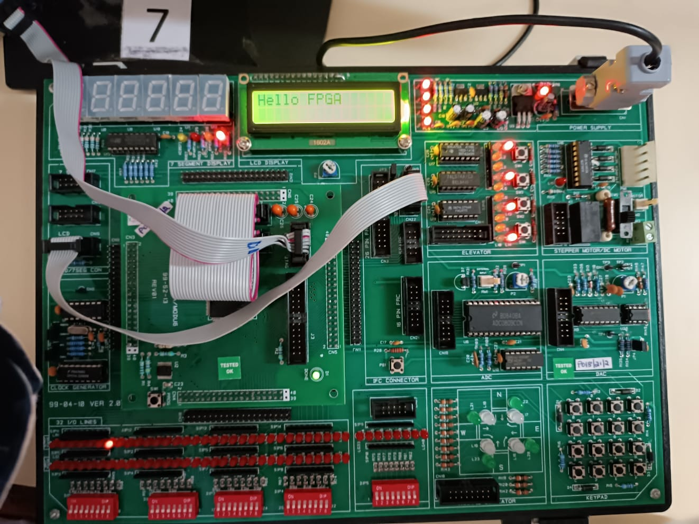

# Verilog LCD Character-Display Driver (Spartan-6)

An RTL driver for a **16×2 HD44780 character LCD**, written in Verilog and taken through the full FPGA flow — RTL → simulation → synthesis in **Xilinx ISE** → **on-board bring-up on a Spartan-6**.



---

## What it does

The controller is a finite state machine that:

1. Waits out the LCD power-on delay.
2. Runs the HD44780 **initialisation sequence** — Function Set (`0x38`: 8-bit, 2 lines, 5×8 dots) → Display ON (`0x0C`) → Clear Display (`0x01`) → Entry Mode (`0x06`).
3. Sets the DDRAM address for line 1, then enters the **`WRITE_DATA` state** — `rs=1`, `rw=0`, streaming ASCII bytes from an internal message array and incrementing `char_count` until the string is written.
4. Repeats for line 2, then holds the display.

Change the two message arrays (`line1`, `line2`) in [`rtl/lcd_controller.v`](rtl/lcd_controller.v) to display any text.

## Interface

| Signal | Dir | Meaning |
|--------|-----|---------|
| `clk`  | in  | board oscillator (default param 50 MHz) |
| `rst`  | in  | active-high reset |
| `rs`   | out | 0 = command, 1 = data |
| `rw`   | out | tied low (write-only) |
| `en`   | out | enable strobe |
| `data[7:0]` | out | 8-bit command/data bus |

## Simulate it

Uses [Icarus Verilog](http://iverilog.icarus.com/):

```bash
iverilog -g2012 -o lcd.out rtl/lcd_controller.v tb/lcd_controller_tb.v
vvp lcd.out            # prints each byte as it's written
gtkwave lcd_sim.vcd    # inspect rs / rw / en / data
```

The testbench scales the timing down so the whole init + write sequence completes quickly, and prints each byte:

```
CMD  byte=0x38   CMD byte=0x0c   CMD byte=0x01   CMD byte=0x06   CMD byte=0x80
DATA byte=0x53 (S) ... "SALSABEEL K"   CMD byte=0xc0   DATA "SPARTAN6 LCD"
```

## On the board

Synthesised in Xilinx ISE and run on a Spartan-6 — the LCD showing driven text is in `docs/images/`:

- `board_lcd_output_1/2/3.jpeg` — LCD displaying text on the board
- `board_setup.jpeg` — the bench setup
- `ise_simulation_waveform.jpeg` — ISE simulation waveform

To target hardware, add a `.ucf` mapping `clk`, `rst`, `rs`, `rw`, `en`, and `data[7:0]` to your board's pins (oscillator pin, a reset button/switch, and the LCD header), then generate the bitstream in ISE.

## Repository layout

```
verilog-lcd-driver-spartan6/
├── rtl/lcd_controller.v          ← the driver (FSM + init + WRITE_DATA)
├── tb/lcd_controller_tb.v        ← self-printing simulation testbench
└── docs/images/                  ← board photos + ISE waveform
```

## Note on this RTL

The original project `.v` file was lost. This `lcd_controller.v` was **reconstructed to match the exact design documented in the project slides** (8-bit / 2-line / 5×8 init sequence and the `WRITE_DATA` state with `rs=1`, `rw=0`, message array, `char_count`). It compiles and simulates cleanly (verified with Icarus Verilog), and the board photos are from the original hardware run. If the original file resurfaces, drop it in and update the message arrays.
