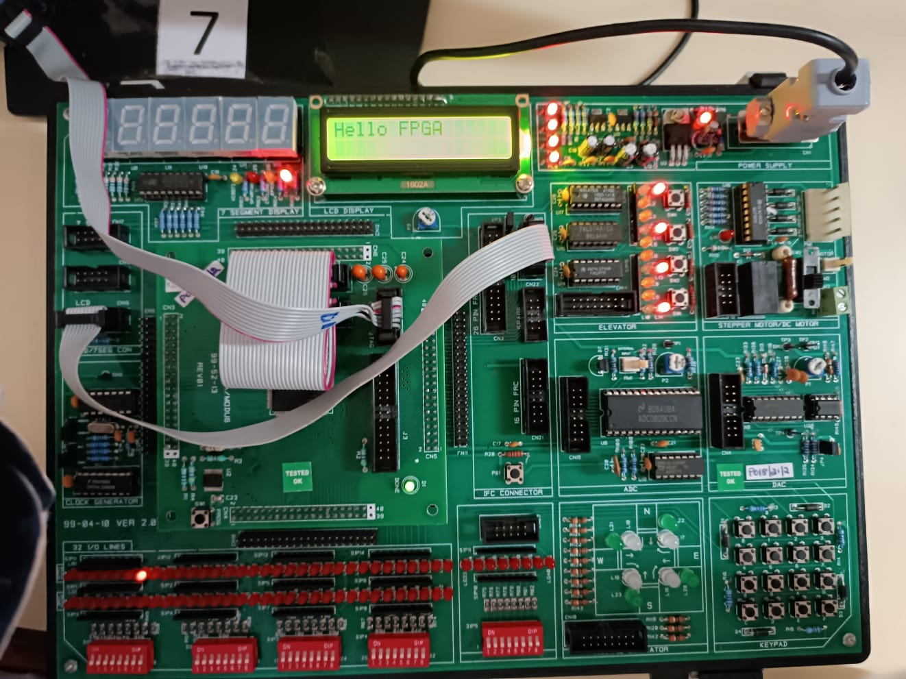
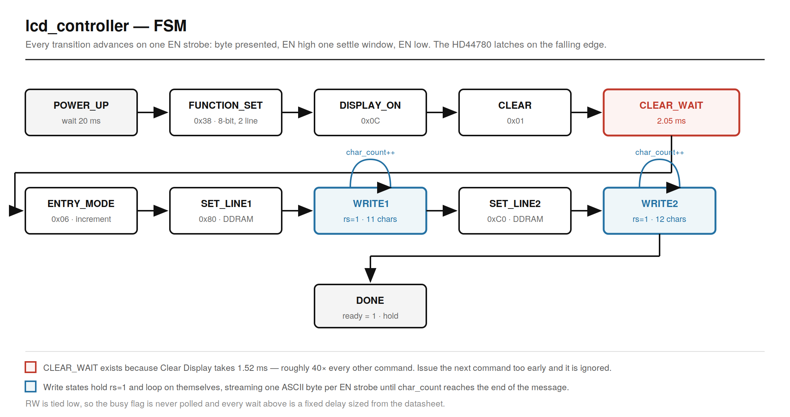
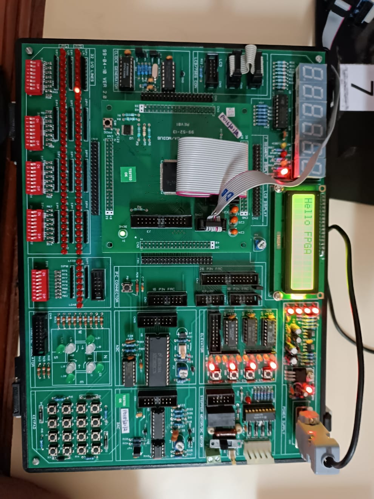
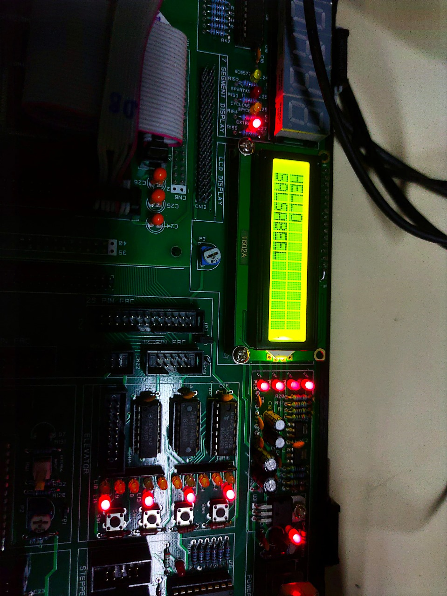
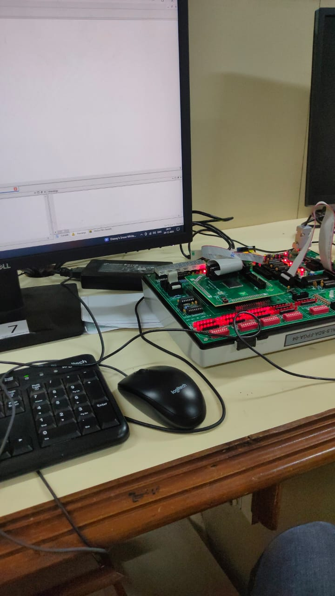
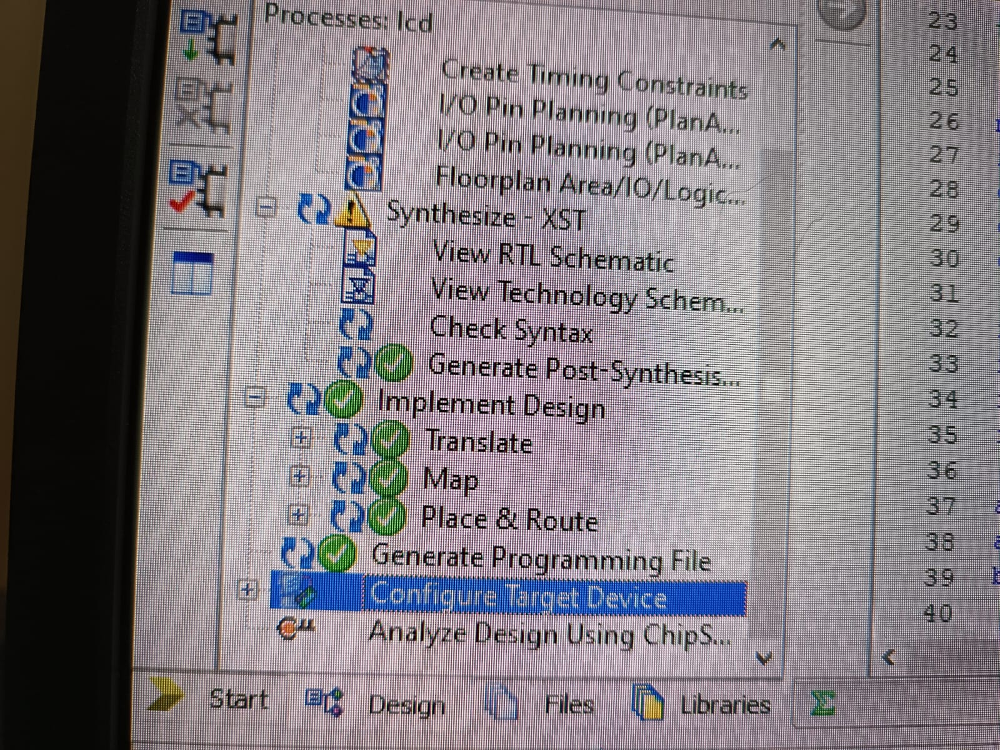

# Verilog LCD Character-Display Driver — Spartan-6

An RTL driver for a **16×2 HD44780 character LCD**, written in Verilog and taken through the full
FPGA flow: RTL → simulation → synthesis in **Xilinx ISE** → bring-up on a **Spartan-6** board.

Solo project, 5th semester.



---

## Overview

HD44780 controllers are easy to drive and easy to get subtly wrong. Most commands finish in
microseconds, but a few take milliseconds, and a command sent too early is silently dropped. This
project drives the LCD straight from FPGA logic with no soft CPU. A small FSM initialises the display
and writes two fixed lines of text, and every wait is a fixed delay derived from the datasheet.

## Features

- 8-bit, write-only HD44780 interface (`RW` tied low, busy flag never polled)
- Full init sequence: power-on wait → Function Set → Display On → Clear → **Clear wait** → Entry Mode
- Writes two lines from an internal message ROM ("SALSABEEL K" / "SPARTAN6 LCD")
- Timing parameterised by `CLK_HZ` and `EN_US`, so changing the board clock keeps the µs delays correct
- `ready` output goes high once both lines are written
- Self-checking Icarus Verilog testbench
- Xilinx ISE constraints template (UCF)

---

## Architecture

```
clk ──► tick generator (one tick every EN_US µs) ──► FSM ──► rs, rw=0, en, data[7:0] ──► HD44780
                                                      ▲
                                    message ROM ──────┘            FSM in S_DONE ──► ready
```

Everything lives in one module, [`rtl/lcd_controller.v`](rtl/lcd_controller.v).

### FSM



Each byte takes one EN strobe: the byte is presented, EN goes high for a settle window, then
low. The HD44780 latches the bus on the **falling** edge of EN.

`RW` is tied low, so the busy flag is never polled. Every wait is a fixed delay sized from the
datasheet. That keeps the design simple, but the delays have to be right.

### The timing that matters

Most HD44780 commands execute in about **37 µs**, so a single 50 µs settle window covers them
comfortably. **Clear Display (0x01) is the exception at 1.52 ms**, roughly forty times longer than
everything else.

If the next command arrives before the clear finishes, the controller is still busy and drops it.
On hardware this shows up as characters missing from the start of line 1, or as a display that works
intermittently depending on how fast the board comes up.

`CLEAR_WAIT` exists for exactly this. At the default 50 MHz / 50 µs parameters:

| Delay | Ticks | Time | Datasheet minimum |
|---|---|---|---|
| Power-on | 401 | 20.05 ms | > 15 ms |
| Clear Display | 41 | 2.05 ms | > 1.52 ms |

(These are the counter values. The FSM spends one more tick leaving each wait state, so the real
delays are slightly longer.)

---

## Project Structure

```
├── rtl/lcd_controller.v            ← the driver (only synthesizable file)
├── tb/lcd_controller_tb.v          ← self-checking testbench
├── constraints/lcd_controller.ucf  ← ISE pin constraints (template)
├── Makefile                        ← sim / wave / clean
├── docs/images/                    ← FSM diagram, board photos, ISE waveform
├── CODEMAP.md / CODEMAP.pdf        ← architecture & learning map
└── LICENSE
```

---

## Requirements

**Simulation:** [Icarus Verilog](http://iverilog.icarus.com/), optionally
[GTKWave](https://gtkwave.sourceforge.net/) and GNU Make. On Windows, `make clean` needs a POSIX
shell (Git Bash / MSYS2).

**Hardware build:** Xilinx ISE (Vivado dropped Spartan-6 support), a Spartan-6 board with a 50 MHz
clock, and an HD44780-compatible 16×2 LCD.

## Installation

No package installation is needed. Clone the repository:

```bash
git clone https://github.com/Sallu-k/Verilog-LCD-Driver-Spartan6_FPGA.git
cd Verilog-LCD-Driver-Spartan6_FPGA
```

## Configuration

| Item | Where | Default | Notes |
|---|---|---|---|
| `CLK_HZ` | `lcd_controller` parameter | 50 000 000 | Board clock; use a whole number of MHz |
| `EN_US` | `lcd_controller` parameter | 50 | Settle window in µs; keep ≥ 37 |
| Message text | `line1` / `line2` arrays + `LEN1` / `LEN2` in [`rtl/lcd_controller.v`](rtl/lcd_controller.v) | "SALSABEEL K" / "SPARTAN6 LCD" | Max 16 characters per line |
| Pin locations | [`constraints/lcd_controller.ucf`](constraints/lcd_controller.ucf) | placeholders | **Must** be replaced for your board |

There are no environment variables or secrets.

## Interface

| Signal | Dir | Meaning |
|---|---|---|
| `clk` | in | board oscillator (`CLK_HZ` parameter, default 50 MHz) |
| `rst` | in | active-high reset (synchronous) |
| `rs` | out | 0 = command, 1 = data |
| `rw` | out | tied low (write-only) |
| `en` | out | enable strobe |
| `data[7:0]` | out | 8-bit command/data bus |
| `ready` | out | high once both lines have been written |

The datasheet delays are derived from `EN_US`, so changing the clock doesn't silently break the timing.

---

## Usage / Development — Simulate

```bash
make sim        # compile and run
make wave       # open the VCD in GTKWave
make clean      # remove lcd.out and lcd_sim.vcd
```

Or directly with Icarus Verilog:

```bash
iverilog -g2012 -o lcd.out rtl/lcd_controller.v tb/lcd_controller_tb.v && vvp lcd.out
```

## Testing

The testbench is **self-checking**. It runs the DUT with compressed timing (`CLK_HZ = 1 MHz`,
`EN_US = 2`), captures every byte on the falling edge of EN, and compares the stream against the
expected HD44780 sequence. It then checks the Clear Display delay against the datasheet minimum:

```
  [ 0] CMD  0x38 (8)  ok
  [ 1] CMD  0x0c (.)  ok
  [ 2] CMD  0x01 (.)  ok
  ...
  [15] DATA 0x4b (K)  ok
  [16] CMD  0xc0 (.)  ok
  ...
Clear Display settle: 1001 ticks x 2 us = 2002 us
  ok: clears the 1520 us the datasheet requires

ALL CHECKS PASSED (28 bytes verified)
```

The timing check reads the design's own parameters rather than measuring simulation time. The
testbench runs with compressed timing, so raw sim time would mean nothing.

**Known gap:** the DUT writes 29 bytes (5 commands + 11 + 1 + 12), but the expected stream has
`N = 28` entries and stops at the `"C"` of line 2. The final `"D"` is therefore not checked.
The power-on delay and EN pulse widths are not asserted either.

---

## Hardware

Synthesis uses **Xilinx ISE**. ISE is required rather than Vivado because Vivado dropped Spartan-6
support entirely, so a Spartan-6 bitstream can only come from ISE.

[`constraints/lcd_controller.ucf`](constraints/lcd_controller.ucf) is a **template**. The `LOC`
values are placeholders, and every one must be replaced with the real pin from your board's
schematic. A bitstream built with wrong LOCs programs without errors and does nothing.

The UCF sets a 20 ns (50 MHz) clock constraint, LVCMOS33 I/O, and `DRIVE = 8` / `SLEW = SLOW` on the
LCD lines because they run over a ribbon cable. A 5 V HD44780 module usually accepts 3.3 V logic,
but its Vdd still needs 5 V for the contrast to work. `ready` can optionally drive an LED.

### On the board

| | |
|---|---|
|  |  |


*Bench setup.*


*ISE simulation waveform.*

---

## Troubleshooting

| Symptom | Likely cause |
|---|---|
| First characters of line 1 missing / intermittent display | Command sent during Clear Display. `CLEAR_WAIT` handles this; check that `EN_US` and `CLEAR_TICKS` weren't changed |
| Board programs but nothing happens | UCF `LOC`s still placeholders |
| Backlight on, no characters | LCD Vdd / contrast not at 5 V, or contrast pot misadjusted |
| Garbled characters | Wiring order of `data[7:0]`, or `CLK_HZ` not matching the real oscillator |
| `make clean` fails on Windows | Run from Git Bash / MSYS2 (`rm` needed) |

## Project Status

- **Working:** RTL passes the self-checking simulation.
- **Not yet verified:** the corrected RTL has **not been re-run on hardware**. The photos are from the
  original hardware run (see Provenance).
- **Limitations:** fixed text only (no runtime input), write-only (no busy-flag polling), 8-bit
  mode only, sequence runs once per reset, UCF is a template, testbench skips the last byte.

## Roadmap

- Re-run the corrected RTL on hardware (pending, per Provenance).

No other future work is currently planned.

## Provenance

None of this takes away from the work, so it is stated plainly here.

**The design was adapted from an open-source HD44780 Verilog driver** that streamed ASCII from an
internal message array. The original source wasn't recorded at the time and couldn't be found
afterwards. Learning from a reference implementation is normal practice; not crediting it wouldn't
be.

**The original project `.v` was later lost.** This file was reconstructed to match the FSM
documented in the project report and then **corrected**. The reconstruction reproduced the
original's missing Clear Display delay, which was caught by checking each command against the
datasheet.

## License

MIT. See [LICENSE](LICENSE). The upstream driver this design was adapted from (see Provenance)
could not be identified, so its license is unknown.

## Documentation

- [CODEMAP.md](CODEMAP.md): structured architecture/learning map (components, workflows, facts, uncertainties)
- [CODEMAP.pdf](CODEMAP.pdf): human-readable version of the same map
- [docs/images/fsm_diagram.svg](docs/images/fsm_diagram.svg): FSM diagram
- HD44780U datasheet (Hitachi) for command codes and timing

## CodeMap Learning

This project includes CODEMAP.md and CODEMAP.pdf, which provide a structured architecture and learning map for use with CodeMap Learning.
